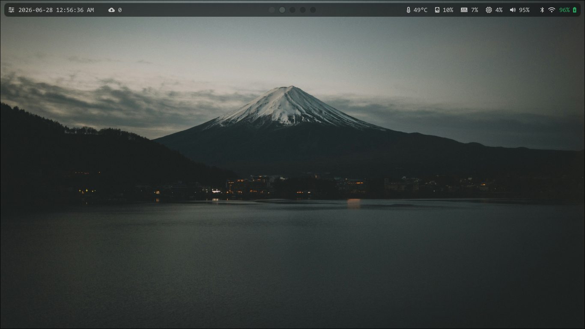

# dotfiles



My personal Arch Linux configuration managed with [GNU Stow](https://www.gnu.org/software/stow/).

## Setup

### Dependencies

- `git`
- `stow`
- `yay` (AUR helper)

### Fresh install

```bash
git clone https://github.com/Parzival129/dotfiles.git ~/dotfiles
cd ~/dotfiles
bash install.sh
```

The install script will:
1. Install all packages from `pkglist.txt` (official repos) and `aurpkglist.txt` (AUR)
2. Stow all configs into place via symlinks
3. Enable NetworkManager, bluetooth, tlp, and ly

After rebooting, set your first wallpaper (this also generates the initial color scheme):

```bash
wal -i ~/pictures/wallpapers/<image>
```

From then on use `Super+L` to pick wallpapers.

---

## What's included

| Package | Config location | Description |
|---|---|---|
| `hypr` | `~/.config/hypr/` | Hyprland compositor config |
| `waybar` | `~/.config/waybar/` | Status bar with multiple themes |
| `kitty` | `~/.config/kitty/` | Terminal emulator |
| `rofi` | `~/.config/rofi/` | App launcher |
| `wofi` | `~/.config/wofi/` | Wayland app launcher |
| `wlogout` | `~/.config/wlogout/` | Logout screen |
| `fastfetch` | `~/.config/fastfetch/` | System info display |
| `btop` | `~/.config/btop/` | Resource monitor |
| `cava` | `~/.config/cava/` | Audio visualizer with custom shaders |
| `wal` | `~/.config/wal/` | Pywal color scheme templates |
| `astronvim` | `~/.config/astronvim/` | Neovim config (launch with `av`) |
| `shell` | `~/.bashrc`, `~/.bash_profile` | Shell config |
| `git` | `~/.gitconfig` | Git config |
| `xorg` | `~/.Xresources` | XTerm settings |
| `local` | `~/.local/bin/wallpaper` | Wallpaper picker script |

---

## Wallpaper & theming

Wallpapers live in `~/pictures/wallpapers/`. The setup uses [awww](https://github.com/LGFae/swww) for wallpaper rendering and [pywal](https://github.com/dylanaraps/pywal) to generate color schemes from the wallpaper.

`Super+L` opens a rofi picker — selecting a wallpaper will:
1. Set the wallpaper via `awww`
2. Generate a matching color scheme with `wal`
3. Reload Hyprland (updates border colors)
4. Restart waybar (updates status bar colors)

The last wallpaper and color scheme are restored automatically on login.

---

## Key bindings

| Key | Action |
|---|---|
| `Super+Q` | Open terminal (kitty) |
| `Super+W` | Open browser (firefox) |
| `Super+C` | Open editor (VS Code) |
| `Super+E` | Open file manager (thunar) |
| `Super+R` | App launcher (rofi) |
| `Super+L` | Wallpaper picker |
| `Super+P` | Logout screen (wlogout) |
| `Super+B` | Bluetooth manager |
| `Super+A` | Screenshot (select area) |
| `Super+V` | Toggle floating window |
| `Super+X` | Close active window |
| `Super+S` | Toggle scratchpad |
| `Super+1-0` | Switch workspace |
| `Super+Shift+1-0` | Move window to workspace |
| `Super+Arrow keys` | Move focus |

---

## Stow manually

To apply a single package without running the full install script:

```bash
cd ~/dotfiles
stow <package>
```

To remove a package's symlinks:

```bash
cd ~/dotfiles
stow -D <package>
```

---

## Keeping machines in sync

After changing any config on one machine:

```bash
cd ~/dotfiles
git add -A && git commit -m "describe your change"
git push
```

On the other machine:

```bash
cd ~/dotfiles && git pull
```

Changes to symlinked files take effect immediately. Changes to `hyprland.conf` need `hyprctl reload`.
